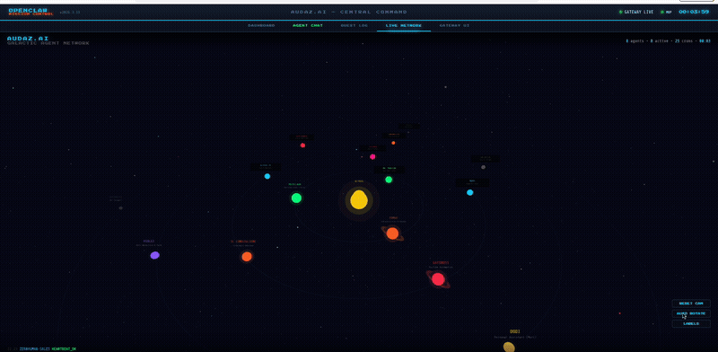
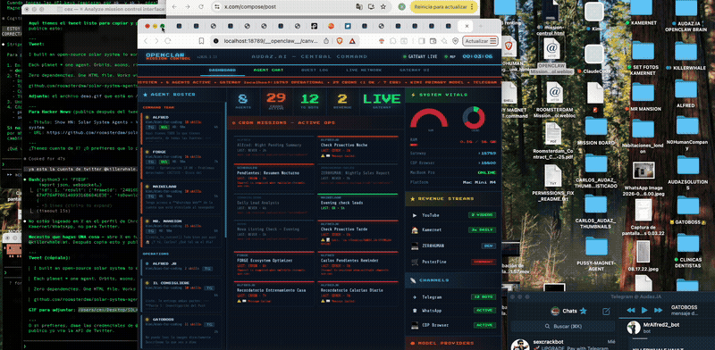

# Solar System Agents

**Visualize your AI agents as a solar system.**

An interactive orbital dashboard where each AI agent is a planet orbiting your central core. Built for teams running multi-agent AI systems who need a beautiful, real-time command center.

> Zero dependencies. One HTML file. Works with any agent framework.

<p align="center">
  
  
  
  
  
</p>

---

<p align="center">
  
</p>

<p align="center"><em>Your AI agents, orbiting in real-time.</em></p>

<p align="center">
  
</p>

<p align="center"><em>Mission Control — cyberpunk command center with real-time agent monitoring.</em></p>

---

## What is this?

If you run AI agents (CrewAI, LangChain, AutoGPT, OpenAI Assistants, custom frameworks), you probably monitor them through logs, terminals, or generic dashboards.

**Solar System Agents** gives you a real-time visual command center where:

- The **Sun** is your core system / gateway
- Each **planet** is an AI agent, orbiting based on its role and activity
- **Moons** are sub-agents or tools attached to a parent agent
- **Rings** (like Saturn) indicate agents with scheduled/cron tasks
- Planet **size** reflects importance, **orbit speed** reflects activity level
- **Glow and trails** show which agents are actively working

Click any planet to see detailed stats. Zoom in/out. Pan around. Watch your agents orbit in real-time.

## Deploy in 30 Seconds

[](https://vercel.com/new/clone?repository-url=https%3A%2F%2Fgithub.com%2Froomsterdam%2Fsolar-system-agents)
[](https://app.netlify.com/start/deploy?repository=https://github.com/roomsterdam/solar-system-agents)

Or run locally:

```bash
git clone https://github.com/roomsterdam/solar-system-agents.git
cd solar-system-agents
open index.html
```

That's it. No build step. No npm install. No dependencies.

## Configure Your Agents

Edit the `AGENTS` array in `index.html`:

```javascript
const AGENTS = [
  {
    id: 'my-agent',
    name: 'RESEARCHER',
    planet: 'Earth',        // visual theme
    color: '#4488ff',        // planet color
    size: 9,                 // planet radius
    orbit: 130,              // distance from sun
    speed: 0.008,            // orbital speed
    role: 'Deep research & analysis',
    model: 'claude-opus-4-6',
    status: 'active',        // 'active' or 'idle'
    tasks24h: 34,
    successRate: 98,
    moons: [                 // optional sub-agents
      { name: 'SCRAPER', size: 2, orbit: 16, speed: 0.04, color: '#88aacc' }
    ]
  },
  // ... add more agents
];
```

## Features

**Visual**
- Canvas2D rendered solar system with orbital mechanics
- Sun with corona glow, pulse animation, and radial gradients
- Per-agent glow, trails, and selection highlights
- Saturn-style rings for scheduled agents
- Moon sub-agents orbiting parent planets
- Animated starfield with twinkle effect
- Smooth zoom (scroll), pan (drag), and reset controls

**Dashboard**
- Top HUD: agent count, active count, tasks/24h, uptime
- Right panel: full agent roster with status dots
- Click-to-select: detailed stats panel per agent
- Real-time clock and FPS counter
- Bottom status bar

**Technical**
- Single HTML file, zero dependencies
- Canvas2D (no WebGL required)
- 60fps on any modern browser
- Retina/HiDPI display support
- ~1000 lines of clean, readable code
- Framework agnostic — works with anything

## Connecting Live Data

The default setup uses static data. To connect real agents:

### Option 1: Direct JavaScript
Update the `AGENTS` array from your API:

```javascript
async function syncAgents() {
  const data = await fetch('/api/agents').then(r => r.json());
  data.forEach(agent => {
    const planet = AGENTS.find(a => a.id === agent.id);
    if (planet) {
      planet.status = agent.status;
      planet.tasks24h = agent.tasks_24h;
      planet.successRate = agent.success_rate;
    }
  });
}
setInterval(syncAgents, 15000);
```

### Option 2: WebSocket (real-time)
```javascript
const ws = new WebSocket('ws://localhost:8080/agents');
ws.onmessage = (e) => {
  const update = JSON.parse(e.data);
  const planet = AGENTS.find(a => a.id === update.id);
  if (planet) Object.assign(planet, update);
};
```

### Framework Adapters (coming soon)
- CrewAI
- LangChain / LangGraph
- AutoGPT
- OpenAI Assistants API
- Semantic Kernel
- Custom REST/WebSocket

## Use Cases

- **AI Startups**: Monitor your production agent fleet
- **Dev Teams**: Visualize CI/CD bots, code review agents, test runners
- **Sales Teams**: Track outreach agents, lead gen bots, CRM automation
- **Content Teams**: Monitor social media agents, content generators
- **Security**: Watch threat detection agents, compliance monitors
- **Personal**: Your own AI assistant ecosystem

## Roadmap

- [ ] Live data adapters (CrewAI, LangChain, AutoGPT)
- [ ] Agent-to-agent communication lines (visual connections)
- [ ] Asteroid belt for queued tasks
- [ ] Comet events for alerts/incidents
- [ ] Dark mode / light mode / custom themes
- [ ] Mobile responsive layout
- [ ] Docker + SaaS hosted version
- [ ] Agent marketplace & templates
- [ ] Team collaboration features
- [ ] Webhooks & notification integrations

## Contributing

PRs welcome. The codebase is intentionally simple — one HTML file with inline CSS and JS. Keep it that way.

```bash
# Fork, clone, edit, open index.html in browser to test
# No build process needed
```

## License

MIT License. Use it however you want.

---

**Built by [AUDAZ.AI](https://github.com/roomsterdam)** — We build AI agent infrastructure.

If this helped you, star the repo. It helps others find it.
