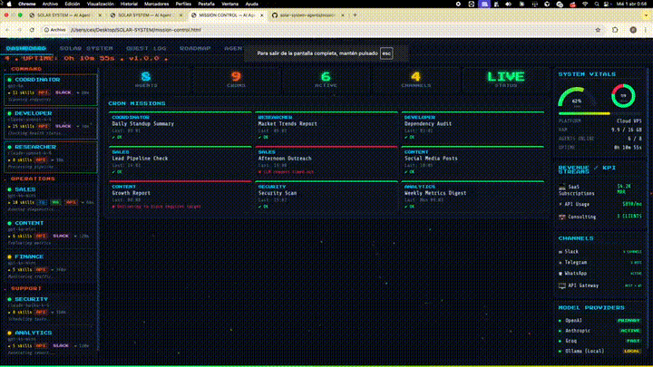

# Solar System Agents

**The AI agent dashboard your team actually wants to look at.**

A cyberpunk command center for monitoring AI agent fleets in real-time. Two views: an orbital solar system visualization and a full mission control dashboard. Works with any agent framework.

> Zero dependencies. Static HTML files. No build step. No npm install.

<p align="center">
  
  
  
  
  
</p>

<p align="center">
  <a href="https://vercel.com/new/clone?repository-url=https://github.com/Audazia/solar-system-agents"></a>
  &nbsp;
  <a href="https://app.netlify.com/start/deploy?repository=https://github.com/Audazia/solar-system-agents"></a>
</p>

---

<p align="center">
  
</p>

<p align="center"><em>Mission Control — real-time agent monitoring with cyberpunk UI.</em></p>

<p align="center">
  
</p>

<p align="center"><em>Solar System — your agents orbiting in real-time.</em></p>

---

## What You Get

### Mission Control (`mission-control.html`)
A full-featured dashboard with:
- **Agent Roster** — live status, model, skills, and channel tags for every agent
- **Scheduled Missions** — cron job monitoring with OK/ERR status
- **System Vitals** — RAM gauge, uptime, platform info with Chart.js graphs
- **KPI Streams** — revenue, API usage, or any metrics you track
- **Channels & Providers** — Slack, Telegram, WhatsApp, API status at a glance
- **Live ticker** — scrolling status bar across the bottom
- **Particle network background** — tsParticles with interactive hover effects
- **Scanline overlay** — CRT retro feel
- **Demo mode** — works out of the box with realistic sample data

### Solar System (`index.html`)
An orbital visualization where:
- The **Sun** is your core system / gateway
- Each **planet** is an AI agent (size = importance, speed = activity)
- **Moons** are sub-agents or tools
- **Rings** (Saturn-style) indicate agents with cron jobs
- Click any planet for detailed stats

## Deploy in 30 Seconds

[](https://vercel.com/new/clone?repository-url=https%3A%2F%2Fgithub.com%2FAudazia%2Fsolar-system-agents)
[](https://app.netlify.com/start/deploy?repository=https://github.com/Audazia/solar-system-agents)

Or run locally:

```bash
git clone https://github.com/Audazia/solar-system-agents.git
cd solar-system-agents
open mission-control.html
```

That's it. The dashboard loads with demo data showing 12 agents, 11 cron jobs, 4 channels, and 4 model providers. Everything renders at 60fps.

## Configure Your Agents

Edit `config.js` to set up your own fleet:

```javascript
const CONFIG = {
  brand: {
    name: 'MY COMPANY',
    subtitle: 'MISSION CONTROL',
    centerTitle: 'AI OPERATIONS HQ',
  },

  agents: [
    {
      id: 'researcher',
      name: 'RESEARCHER',
      model: 'claude-sonnet-4-6',
      role: 'Deep research & analysis',
      tier: 'command',       // 'command' | 'operations' | 'support'
      premium: true,         // highlighted card
      skills: 8,
      channels: ['API', 'SLACK'],
      status: 'active',      // 'active' | 'idle' | 'error' | 'dormant'
    },
    // ... add more agents
  ],

  crons: [
    { agent: 'RESEARCHER', name: 'Daily Report', schedule: '06:00', status: 'ok' },
  ],

  channels: [
    { name: 'Slack', icon: '\u2709', status: 'online', detail: '4 CHANNELS' },
  ],

  providers: [
    { name: 'Anthropic', detail: 'claude-sonnet-4-6', status: 'active', label: 'PRIMARY' },
  ],
};
```

See `config.js` for the full configuration reference with all available options.

## Connect Live Data

### Option 1: API Polling (built-in)
Set your gateway URL in `config.js`:

```javascript
gateway: {
  url: 'http://localhost:8080',
  healthEndpoint: '/health',
  statusEndpoint: '/api/status',
  refreshInterval: 15000,
},
```

The dashboard polls your API every 15 seconds and updates agent status dots and last messages.

### Option 2: Direct JavaScript
Update agent data from your own API:

```javascript
async function syncAgents() {
  const data = await fetch('/api/agents').then(r => r.json());
  data.forEach(agent => {
    const dot = document.getElementById('dot-' + agent.id);
    if (dot) dot.className = 'status-dot ' + (agent.active ? 'green' : 'yellow');
  });
}
setInterval(syncAgents, 10000);
```

### Option 3: WebSocket (real-time)
```javascript
const ws = new WebSocket('ws://localhost:8080/agents');
ws.onmessage = (e) => {
  const update = JSON.parse(e.data);
  const dot = document.getElementById('dot-' + update.id);
  if (dot) dot.className = 'status-dot ' + update.statusClass;
};
```

## Works With Any Framework

- **CrewAI** / **LangChain** / **LangGraph**
- **AutoGPT** / **BabyAGI**
- **OpenAI Assistants API**
- **Semantic Kernel**
- **Custom REST/WebSocket agents**
- **OpenClaw** (built with this)

## Use Cases

| Who | What |
|-----|------|
| **AI Startups** | Monitor production agent fleet |
| **Dev Teams** | Visualize CI/CD bots, code review agents |
| **Sales Teams** | Track outreach agents, lead gen bots |
| **Content Teams** | Monitor social media agents, content generators |
| **Security** | Watch threat detection agents, compliance monitors |
| **Solo Builders** | Your personal AI assistant ecosystem |

## Hosting

| Method | Cost | Setup Time |
|--------|------|------------|
| Open `index.html` locally | Free | 10 seconds |
| GitHub Pages | Free | 2 minutes |
| Vercel (button above) | Free | 30 seconds |
| Netlify (button above) | Free | 30 seconds |
| Any static host | Free-$5/mo | 5 minutes |

## Roadmap

- [x] Solar System orbital visualization
- [x] Mission Control dashboard
- [x] Configurable agents, crons, channels, providers
- [x] Demo mode (works without config)
- [x] Live data polling via API
- [x] Mobile responsive layout
- [ ] Framework adapters (CrewAI, LangChain, AutoGPT)
- [ ] Agent-to-agent communication lines
- [ ] Asteroid belt for queued tasks
- [ ] Comet events for alerts/incidents
- [ ] Custom themes (dark/light/custom)
- [ ] Docker image with built-in API server
- [ ] SaaS hosted version with auth + team features
- [ ] Agent marketplace & templates
- [ ] Webhooks & notification integrations

## Contributing

PRs welcome. The codebase is intentionally simple — static HTML with inline CSS and JS. No build tools. Keep it that way.

```bash
# Fork, clone, edit, open in browser to test
```

## License

MIT License. Use it however you want.

---

**Built by [AUDAZ.IA](https://github.com/Audazia)** — We build AI agent infrastructure.

If this helps you, star the repo. It helps others find it.
